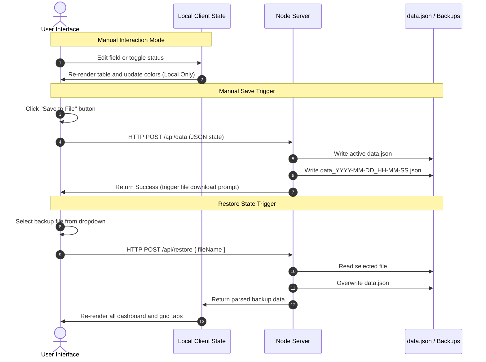

# Process & Product Definition Document (PDD)
## F&A AI Penetration & Assessment Portfolio Dashboard

**Document Version**: v1.8.0  
**Date**: June 2026  
**Target Domain**: Finance & Accounting (F&A) Operations  
**Author**: Antigravity Pair Programming AI  

---

## Table of Contents
1. [Executive Summary & Objective](#1-executive-summary--objective)
2. [System Architecture & Tech Stack](#2-system-architecture--tech-stack)
3. [User Interface & Layout Design](#3-user-interface--layout-design)
4. [Functional Modules & Requirements](#4-functional-modules--requirements)
5. [Process Rules & Business Constraints](#5-process-rules--business-constraints)
6. [Data Model & API Specifications](#6-data-model--api-specifications)
7. [Mermaid System Interactions Diagram](#7-mermaid-system-interactions-diagram)
8. [Log of Solved Issues & Version History](#8-log-of-solved-issues--version-history)
9. [Technical Reference & Interactive Sandbox](#9-technical-reference--interactive-sandbox)
10. [Executive AI Leaderboard](#10-executive-ai-leaderboard)

---

## 1. Executive Summary & Objective

The **F&A AI Penetration & Assessment Portfolio Dashboard** is a custom enterprise web application designed to track, analyze, and manage the deployment of artificial intelligence solutions (assets) across Finance & Accounting operations. 

### Core Objectives:
- **Baseline Tracking**: Capture baseline FTEs (Full-Time Equivalents) across client accounts, operational regions, and process towers.
- **AI Potential Assessment**: Quantify addressable FTEs and identified AI Potential FTEs.
- **Asset Mapping Matrix**: Directly allocate specific AI assets to account towers, managing status states from ideation to production.
- **Governance & Accountability**: Match process lines to registered organizational owners and support instant direct-email follow-ups.
- **Historical Backups**: Allow users to restore past configurations via manual loading of date-stamped server backups.

---

## 2. System Architecture & Tech Stack

The application is structured as a lightweight, performant single-page application (SPA) with a Node.js backend.

```
+-------------------------------------------------------------+
|                     Client Web Browser                      |
|  - HTML5 Structure & Semantic Layout                         |
|  - Vanilla CSS3 (Accenture Palette, Custom Grids, Flexbox)  |
|  - Vanilla Javascript SPA Logic                             |
|  - Libraries: Chart.js, SheetJS (XLSX), PPTXGenJS           |
+-------------------------------------------------------------+
                              |
                     JSON REST APIs (HTTP)
                              |
+-------------------------------------------------------------+
|                      Node.js Express Server                 |
|  - Static File Server (public/ folder)                     |
|  - REST endpoints for data state retrieval & updates        |
|  - Backup file scanning & restoration logic                 |
|  - Database: flat data.json & data_YYYY-MM-DD_HH-MM-SS.json |
+-------------------------------------------------------------+
```

---

## 3. User Interface & Layout Design

The user interface follows Accenture's sleek executive branding guidelines, utilizing deep navies, slate greys, and vibrant accent blues to define data sections.

### Key Layout Enhancements:
- **Accenture Accent Color Coding**: 
  - Base operational columns (Client Name, Region, Tower, Base FTE, Addressable FTE) are rendered in professional Dark Navy (`#1f497d`).
  - The AI Asset column headers are styled in a distinct **Accenture Digital Blue** (`#0072c6`) to immediately segment baseline metrics from technology mapping.
  - The Future State FTE column is highlighted in deep navy (`#153456`).
- **Manually Resizable Columns**: 
  - Mouse hover resize handles (`col-resize`) are embedded on the header borders of the Client Name columns on both tabs, and **all columns** of the Asset Mapping Grid.
  - Custom column widths are tracked in local memory to persist widths seamlessly across tab swaps and table updates.
- **Rotated Asset Headers**:
  - A checkbox labeled **"Rotate Headers"** in the matrix header toggles a vertical label rendering mode (`writing-mode: vertical-rl; transform: rotate(180deg)`).
  - Activating this option collapses asset column widths to `25px`, wrapping values cleanly and making the grid highly presentable for up to 100 assets.
- **Status Legends**: Background select styling matches status rules:
  - **Deployed / Completed**: Green (`#70ad47`)
  - **Potential but lack CBA**: Light Green (`#c6efce` background, `#276a3c` text)
  - **In Progress**: Orange/Yellow (`#ffc000`)
  - **Awaiting Client Approval**: Grey (`#a6a6a6`)
  - **Dropped**: Light Grey (`#f2f2f2`)
  - **Ideation**: White (`#ffffff`)

---

## 4. Functional Modules & Requirements

### A. Input Dashboard
- Allows inline additions and deletions of process lines.
- Integrates master configuration lists for Clients, Regions, Towers, Billing Types, Assets, and Owners via modal editors.
- Disables downstream asset fields when a row is in `Not Started` or `No Scale` assessment states.
- Utilizes select dropdowns for Client Name, Tower, and Proposed Asset inputs. New rows added via `+ Add Row` start with empty Client Name and Tower values (`-- Select Client --` and `-- Select Tower --`).
- The Proposed Asset dropdown includes all assets in the master list, plus a `+ Enter Custom Asset...` option to prompt the user for inline manual entry.
- Features multi-select filters synchronized across tabs for Client Name, Region, Tower, Assessment Status, Asset (initiative), Initiative Type (Type), and Client Approval Status (Status).

### B. Asset Mapping Grid
- Renders an N×M matrix mapping operational rows (rows) to available AI assets (columns).
- Clicking a cell opens a custom allocation popover to enter custom FTE releases and status states.

### C. Client FTE Summary
- Groups rows by Client Name.
- Calculates total Client FTEs (summing the maximum baseline FTE of unique towers per client) alongside total addressable FTE, pipeline FTE, estimated benefit, and remaining potential.

### D. Totals & Insights
- Displays card-based executive KPIs.
- Renders 5 dynamic Chart.js dashboards:
  1. Pipeline vs Benchmark by Tower (Bar Chart)
  2. Status Distribution (Doughnut Chart)
  3. Asset Penetration by Client (Top 10 Horizontal Bar)
  4. High Opportunity Targets (Awaiting Approval Bar)
  5. AI Penetration by Billing Type (Radar/Polar Chart)
- Features an editable Portfolio Insights sidebar allowing custom warning, info, and success observations.

---

## 5. Process Rules & Business Constraints

> [!IMPORTANT]
> The application enforces strict data validations during manual entries and Excel bulk uploads:
> 1. **Tower Threshold**: A single Client Name cannot have more than 8 unique Towers defined.
> 2. **FTE Ceiling Constraint**: The sum of `Addressable FTE` across all rows for a given Client + Tower combination must not exceed the maximum `Baseline FTE` defined for that client and tower.
> 3. **Pipeline Bounds**: `AI Potential FTE` cannot exceed `Baseline FTE` and must be greater than or equal to `Estimated FTE Benefit`.
> 4. **Uniqueness Key**: A combination of `Client Name`, `Tower`, `Region`, and `Proposed Asset` acts as a unique primary key. Uploading an Excel sheet with matching keys overrides the existing record instead of creating duplicates.

---

## 6. Data Model & API Specifications

The system state is stored as a structured JSON object.

### Database Schema (data.json)
```json
{
  "clients": [ "Client A", "Client B" ],
  "assets": [ "Invoice Automation", "GL Bot" ],
  "owners": {
    "John Doe": "john.doe@company.com"
  },
  "rows": [
    {
      "id": "row_1718000000000_1234",
      "client": "Client A",
      "region": "APAC",
      "tower": "PTP",
      "billingType": "FTE",
      "baseFte": 150,
      "addressableFte": 120,
      "assessment": "Completed",
      "pipelineFte": 30,
      "initiative": "Invoice Automation",
      "initiativeType": "Agentic",
      "decision": "Deployed",
      "stack": "Python, OpenPyXL",
      "estimatedFteBenefit": 28,
      "realizedFte": 20,
      "implementationCost": 75000,
      "dollarSavings": 120000,
      "owner": "John Doe",
      "benchmark": 25
    }
  ],
  "cellData": {
    "row_1718000000000_1234::Invoice Automation": {
      "fte": 28,
      "status": "Deployed"
    }
  },
  "towers": [ "PTP", "RTR" ],
  "regions": [ "APAC", "EMEA" ],
  "initiativeTypes": [ "Agentic", "RPA" ],
  "customInsights": []
}
```

### REST API Endpoints
- **`GET /api/data`**: Returns active system state.
- **`POST /api/data`**: Overwrites `data.json` and creates a timestamped server backup file `data_YYYY-MM-DD_HH-MM-SS.json`.
- **`GET /api/backups`**: Returns the list of available server backups (retaining the 5 most recent).
- **`POST /api/restore`**: Reads a specified backup JSON file, overwrites the active `data.json`, and loads the data back to the client.

---

## 7. Mermaid System Interactions Diagram



---

## 8. Log of Solved Issues & Version History

### Version 1.8.0 (Current)
* **Owner & Email Directory Auto-Update**: Enhanced bulk upload parser to handle "Owner Email" or "Owner Email id" adjacent to "Owner". The parser auto-registers new owners and emails into the master Owner Directory (avoiding duplicate names and email addresses case-insensitively). Row owner fields are dynamically updated to map directly to the registered owner name in the directory. Manual owner entries also feature case-insensitive name and email validation.

### Version 1.7.8
* **Bulk Upload State Sync**: Integrated dynamic cell allocation mapping synchronization inside `handleBulkUpload()`. Now, when new rows are imported or existing rows are updated via Excel, their proposed initiative, FTE benefit, and status values are automatically mapped to `state.cellData` allocations. This guarantees that imported data instantly and correctly populates the bubbles on the **4 Blocker** page and cell allocations on the **Asset Mapping** page..

### Version 1.7.7
* **Bulk Upload Template Simplification**: Removed the "Asset_Mapping" sheet from the template downloaded via `downloadBulkTemplate()` and updated the "Instructions" sheet steps to remove asset mapping references. The bulk template is now focused purely on adding inputs for the Input Dashboard, while all other pages (Asset Mapping grid, 4 blocker, etc.) derive their allocations and views dynamically from input page records as designed.

### Version 1.7.6
* **Status Column Placement**: Moved the "Status" column to be next to the "Stack" column (immediately following it) on the Input Dashboard page, aligning the table headers and cells.
* **XLS Export Column Realignment**: Updated the Master_Tracker sheet structure in `downloadXls()` and the master template builder in `downloadBulkTemplate()` to match the new dashboard column ordering, including adding a "Stack" column to the template.

### Version 1.7.5
* **Popover Status Sync**: Resolved correct target row in the Client + Tower group when editing cell allocations in the Asset Mapping page. Now changes to asset status correctly update the selected value and color class of the "Status" column dropdown on the input page.
* **Not Applicable Status Clearing**: Explicitly set the proposed row's status (`decision`) to empty and reset benefit to 0 when status is cleared to "Not Applicable" from the Asset Mapping page.

### Version 1.7.4
* **Column Renaming & Asset Mapping Grouping**: Renamed "Client Approval for AI" to "Status". Grouped Asset Mapping grid rows by Client + Tower combination using the maximum baseline FTE, and merged cell allocations.

### Version 1.7.3
* **4 Blocker Quadrant Alignment**: Swapped the Dropped quadrant with Awaiting client approvals. Updated calculations, counts, costs, and bubble rendering to target Awaiting client approvals solutions.

### Version 1.7.2
* **Column Renaming & Addressable Column Integration**: Renamed "Agentic Potential FTE" to "AI Potential FTE" across pages, exports, reports. Restored "Addressable FTE" column to bulk template.

### Version 1.7.1
* **Bulk Upload Template & Owner Validation**: Added columns for Billing Type, Owner, Action Plan to template. Auto-removes uploaded owner if not in master list.

### Version 1.6.1
* **Manually Adjustable Blocker Width**: Integrated horizontal resizer handles on the right edge of the 4 Blocker container to change its width dynamically on drag and persist widths in local storage.
* **Centered Grid Layout**: Centered the 4 Blocker container horizontally on the page using margin rules.
* **Container Query Responsiveness**: Implemented CSS Container Queries (`@container blocker`) on the blocker container to automatically scale bubble elements, watermarks, padding, and text labels depending on the blocker width.
* **Implementation Cost Indicator**: Added implementation cost displays to each bubble, reading row-level cost metrics and formatting them as locale strings (e.g. `Cost: $15,000`).

### Version 1.6.0
* **4 Blocker Portfolio View**: Introduced a new "4 Blocker View" page rendering mapped AI assets dynamically in a 2x2 grid based on their deployment status.
* **FTE Benefit Bubbles**: Solution deployments are represented as bubbles with background status legend colors, sizing, and text writing their estimated FTE benefit values.
* **Auto Update Sync**: Connected tab rendering triggers to refresh dynamically based on database updates made in the Input Dashboard or Asset Matrix Grid.

### Version 1.5.1
* **Client FTE Summary Help Columns**: Added two new text input columns—"Help required" and "Help required from whom"—next to the "Action plan" column on the "Client FTE summary" page only. Inputs are limited to 35 words per cell and support manual column resizing.
* **Expanded Summary Layout**: Set the table and panel headers in the Client FTE Summary tab to take up 75% width on screens with a width of 1080px or higher.
* **XLS Exporter Updates**: Updated `downloadXls()` to include these new fields in the `Client_Summary` worksheet.

### Version 1.5.0
* **Process Column & Master List**: Added a new "Process" column next to the "Tower" column on the Input dashboard and Asset Mapping Grid. Process values are manually selectable from a master dropdown list.
* **Process Configuration Editor**: Integrated a "Processes" master list configuration modal button and editor, allowing dynamic additions and deletions.
* **Filtering and Import/Export Compatibility**: Extended filter bar selections, Excel export templates, bulk upload data integrity parsers, and custom report sheet generators to support the new process field.

### Version 1.4.4
* **Tab Visibility Specificity Fix**: Removed explicit `display: flex;` from `.insights-tab-layout` in `public/styles.css` to allow the active/inactive tab toggles to correctly control the visibility of the Totals & Insights tab, preventing overlap with the AI Leaderboard page.

### Version 1.4.3
* **Simplified Executive AI Leaderboard**: Redesigned the "AI Leaderboard" page to show a single-column horizontal progress bar graph ranking clients with operational business icons.
* **Technical Reference Page Removal**: Removed the "Technical Reference" tab and its associated logic, formulas, and sandboxes to streamline the application for executive users.

### Version 1.4.2
* **Executive AI Leaderboard**: Implemented a dynamic tab page presenting client performance rankings across 3 primary operational metrics: Mapped AI Potential %, Absolute Est. FTE Benefit, and Benefit Realization Rate %.
* **Portfolio Champion Badge**: Calculates and features the top-performing client champion account dynamically in the header card banner based on combined average rank score.
* **Accenture Theme Styling**: Formatted rank indexes with gold/silver/bronze icons and colored horizontal value bars matching each column's specific metric.

### Version 1.4.1
* **Technical Reference Dashboard Page**: Added a dedicated interactive Technical Reference tab in the navigation bar.
* **Filterable Functions Catalog**: Integrated a client-side database listing all functions inside `public/app.js` with their start line numbers, categories, and purposes. Supports dynamic keyword searches and category filter selectors.
* **Core Formula Display**: Documented mathematical formulations for Client FTEs, AI Potential %, Benefit %, Variance %, and Remaining Potential within the visual dashboard cards.
* **Interactive Sandbox Validator**: Implemented a sandbox calculator allowing users to test manual FTE values, showing real-time calculations and check status indicators (PASS/FAIL) for business validation rules.

### Version 1.4.0
* **Technical Appendix**: Added a dedicated functions reference document detailing all function logic, line references, and calculation specs: [functions_reference.md](file:///C:/Users/milind.sawai/.gemini/antigravity/scratch/ai-penetration-dashboard/functions_reference.md).
* **Row-Level Validation Hierarchy**: Enforced strict inputs validations (`Base >= Addressable >= AI Potential >= Realized` and `AI Potential >= Est. Benefit`).
* **Realized FTE Column**: Added manually editable Realized FTE column next to Est. FTE Benefit, with footer sums and full import/export support.
* **Addressable FTE Sum Fix**: Fixed Client FTE Summary to evaluate blank addressable inputs as `0` instead of defaulting to baseline.
* **Variance % Logic**: Aligned Variance % to be `Benefit % - Benchmark %` (where Benefit % = `Est. FTE Benefit / AI Potential FTE`).
* **Est. FTE Benefit Handler**: Implemented `handleFteBenefitChange` to save benefit changes and dynamically update percentages.
* **Stack Column Repositioning**: Moved the Stack column to appear right after the Type column.
* **Client FTE Summary Owners & Action Plans**: Replicated the Owner column next to Remaining Potential (with summary mailing formats) and added manually editable Action Plan columns (with 35-word limits and resizable column width stretching) at the end of both tables.
* **Client Summary XLS Sheet**: Extended `downloadXls()` to include a third worksheet (`Client_Summary`) covering all summary page columns.

### Version 1.3.1
* **Type and Status Filters**: Introduced additional filter dropdown selections for **Type** and **Status** columns on both tabs. Syncs selections across input and asset matrix sheets automatically.

### Version 1.3.0
* **Dropdown Selection for Proposed Assets**: Swapped manual text box inputs for a `<select>` dropdown populated from the master assets list, offering a `+ Enter Custom Asset...` prompt.
* **Empty Defaults for Added Rows**: Modified `+ Add Row` to initialize Client Name and Tower fields as empty (`""`), preventing validation errors and encouraging explicit user choices.

### Version 1.2.0
* **Resizable Columns**: Configured dragging handles for Client Name columns and all matrix columns.
* **Vibrant Accent Headers**: Added Accenture themed blue (`#0072c6`) to asset column headers.
* **Manual Save Model**: Stopped auto-saving to prevent network overhead and browser download loops.
* **Disabled Auto-Polling**: Removed the 5-second interval polling mechanism to protect local edits.
* **Direct Mail Button**: Integrated Outlook mail button (`✉`) next to owner names with pre-formatted row statistics in the body text.
* **Reset Button**: Added a header button to erase all local data inputs on confirmation.

### Version 1.1.0
* **Case-Insensitive Option Matching**: Normalized select options with `.toLowerCase().trim()` to prevent state mismatches.
* **Bulk Upload Uniqueness**: Enabled Client/Tower/Region/Proposed Asset unique key checks to override existing records instead of generating duplicates.
* **Click-to-Email Toggle**: Replaced separate mail envelope icon with direct clickable mail link toggled by pencil edit triggers.
* **Timestamped Backups**: Created timestamped JSON files on saves and implemented restore endpoints.

---

## 9. Technical Reference & Interactive Sandbox

The **Technical Reference & Interactive Sandbox** page (Tab 5) serves as the developer and administrator's handbook directly integrated into the application interface. It combines a live-filtered catalog of codebase functions with a mathematical playground to ensure total transparency of system logic.

### A. Dynamic Functions Catalog
- **Function Database**: Catalogs all core JS functions defined inside `public/app.js`, referencing their starting line numbers, functional categories, and business logic purposes.
- **Search & Categories**: Users can filter functions using a text search field (evaluating name and description fields) and a category select dropdown.
- **Dynamic Count**: A counter status label displays the number of active matching entries (e.g., `45 / 91 functions`).

### B. Interactive Sandbox Validator
- **Live Computations**: Provides an isolated calculator card where users can input custom test values:
  - `Base FTE`
  - `Addressable FTE` (with blank handling)
  - `AI Potential FTE`
  - `Est. FTE Benefit`
  - `Realized FTE`
  - `Benchmark %`
- **Output Validation**: Calculates output metrics (AI Potential %, Benefit %, Variance %, Remaining Potential) and triggers passing/failing status badges for core row validations:
  - **Constraint 1**: Addressable FTE must not exceed Base FTE.
  - **Constraint 2**: AI Potential FTE must not exceed Addressable FTE.
  - **Constraint 3**: Est. FTE Benefit must not exceed AI Potential FTE.
  - **Constraint 4**: Realized FTE must not exceed AI Potential FTE.

---

## 10. Executive AI Leaderboard

The **Executive AI Leaderboard** page (Tab 6) provides a high-level visual comparative index of all active client accounts. Designed specifically for senior leadership, it isolates performance across three critical metrics and highlights portfolio-wide excellence.

### A. Leaderboard Metrics
The dashboard evaluates and ranks clients dynamically across three distinct operational dimensions:
1. **Mapped AI Potential %**: Measures the percentage of Addressable FTEs that have been mapped to identified AI Potential. (Formula: `Pipeline FTE / Addressable FTE * 100`).
2. **Est. FTE Benefit**: Measures the absolute scale of identified productivity savings in FTE counts. (Formula: `Sum of Estimated FTE Benefit`).
3. **Benefit Realization Rate %**: Measures delivery efficiency by comparing realized/deployed savings to identified estimates. (Formula: `Realized FTE / Estimated FTE Benefit * 100`).

### B. Portfolio Champion Logic
- The system ranks clients in descending order within each of the three metrics, assigning a rank index (1st, 2nd, 3rd, etc.) for each.
- An overall **Portfolio Champion score** is computed for each client by averaging their rank positions across all three lists:
  $$\text{Champion Score}_c = \frac{\text{Rank(Potential)}_c + \text{Rank(Benefit)}_c + \text{Rank(Realization)}_c}{3}$$
- The client with the **lowest score** (closest to 1.0 average rank) is featured in the top header banner as the **Overall Portfolio Champion**, complete with their specific scores.

### C. Visual Rank Presentation
- **Visual Rank Badges**: Top ranks are demarcated with custom styled round badges:
  - Rank 1: Gold Gradient (🥇)
  - Rank 2: Silver Gradient (🥈)
  - Rank 3: Bronze Gradient (🥉)
  - Rank 4+: Slate Grey Badge
- **Horizontal Value Bars**: Each client row includes a micro horizontal progress bar showing their relative value against the top client in that column, using distinct accent colors per metric.


